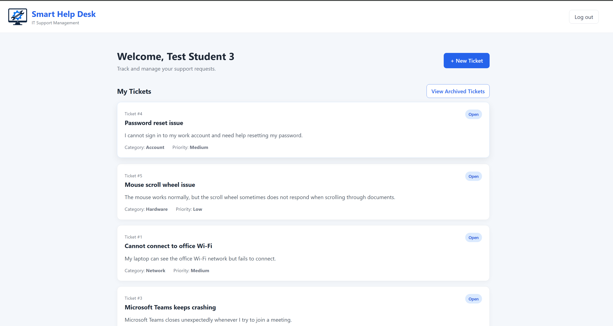
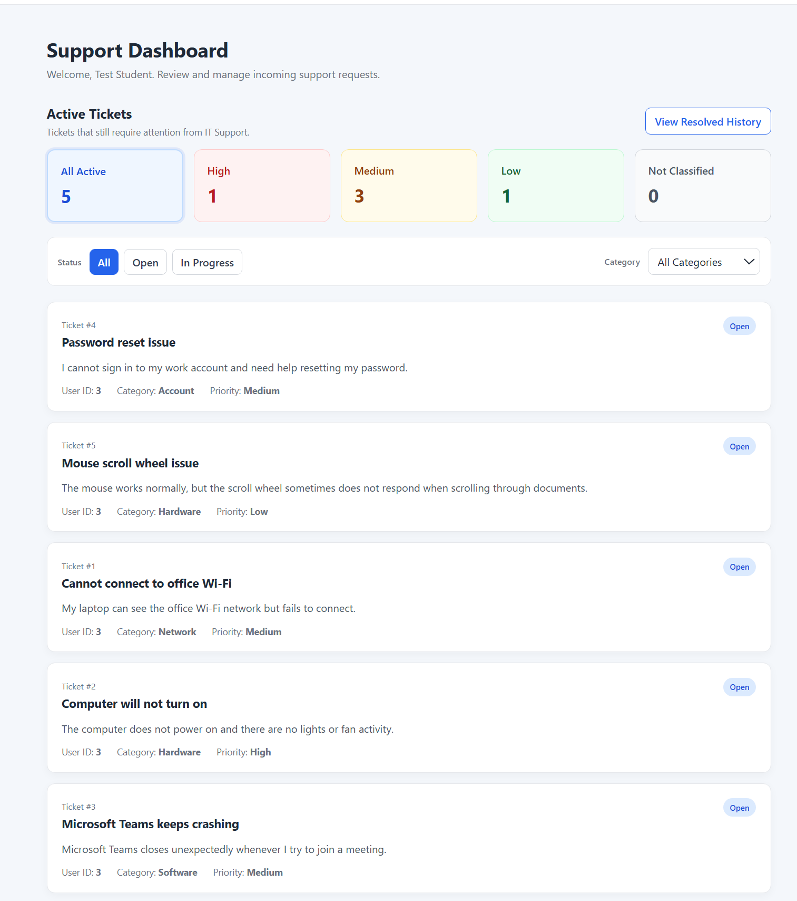
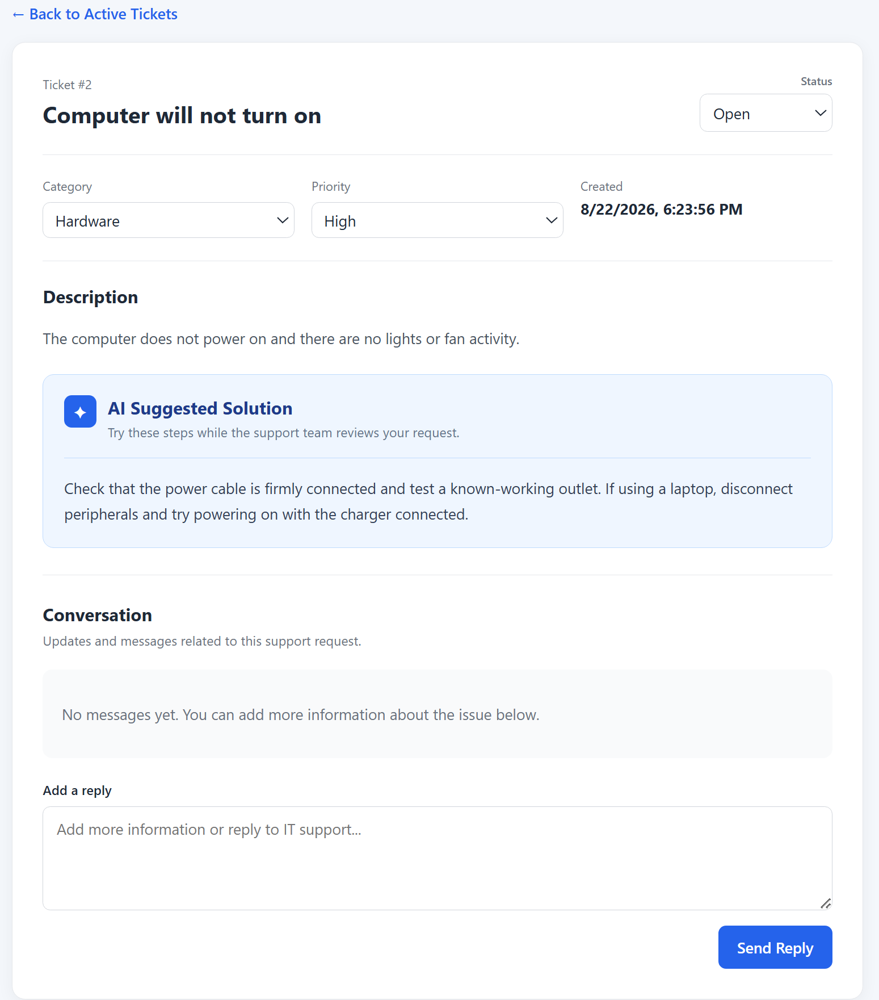
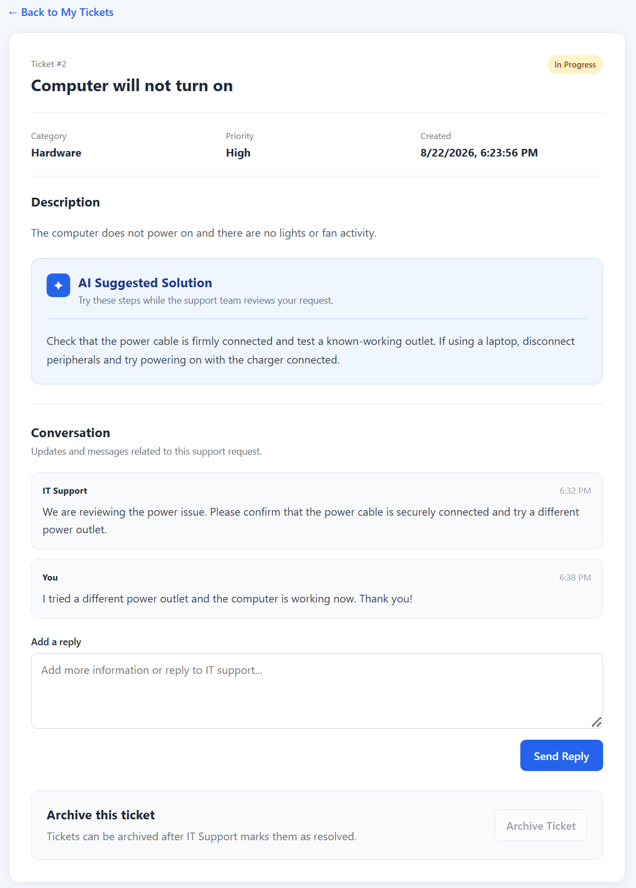
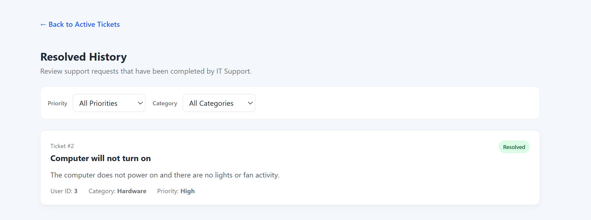
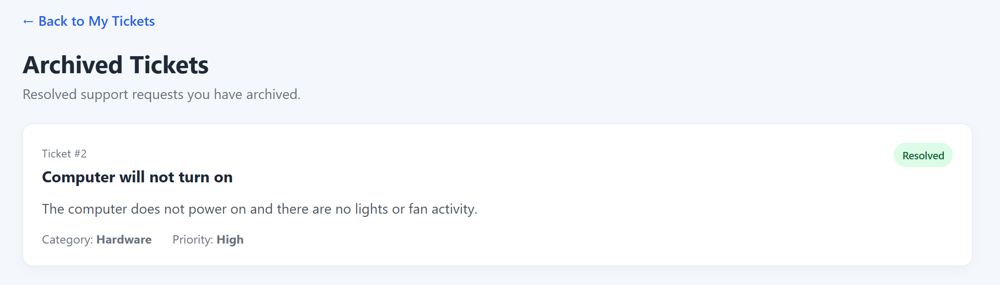
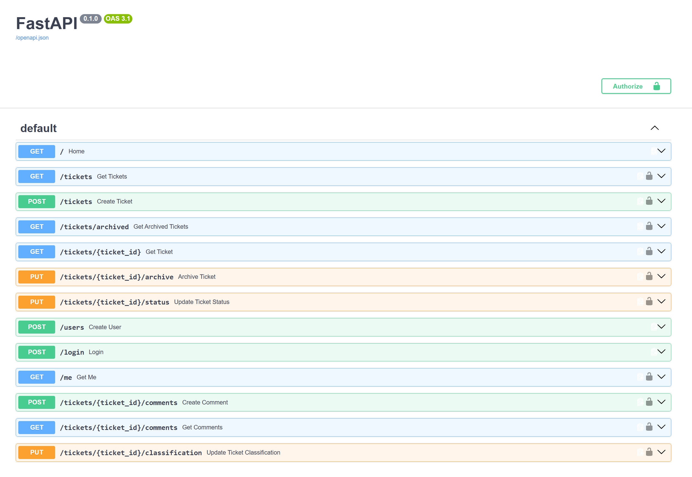

# Smart Help Desk

Smart Help Desk is a full-stack IT support ticket management system designed to simplify communication between users and IT support staff.

Users can submit technical support requests, receive AI-generated troubleshooting suggestions, communicate with IT support, track ticket progress, and archive resolved requests. IT support administrators can manage incoming tickets, update their classification and status, communicate with users, and review resolved ticket history.

## Features

### User

- Register and log in securely
- Create support tickets
- View personal support tickets
- Receive AI-generated troubleshooting suggestions
- View automatically assigned category and priority
- Communicate with IT support through ticket conversations
- Track ticket status
- Optionally archive resolved tickets
- View archived ticket history

### IT Support / Admin

- View all active support tickets
- View ticket counts by priority
- Filter tickets by status and category
- Review AI-generated ticket classification
- Change ticket category and priority when necessary
- Update ticket status: Open, In Progress, or Resolved
- Communicate directly with users
- View resolved ticket history

## AI Integration

Smart Help Desk uses AI when a support ticket is submitted.

The AI analyzes the ticket title and description to:

- Assign a support category
- Determine a priority level
- Generate a short troubleshooting suggestion for the user

The AI-generated classification can still be changed by IT support staff when necessary.

The application is also designed to handle AI service failures gracefully. If the AI service is temporarily unavailable, the support ticket is still created instead of being lost. The ticket can then be manually classified by IT support.

## Technology Stack

### Frontend

- React
- Vite
- JavaScript
- CSS
- React Router

### Backend

- Python
- FastAPI
- SQLAlchemy
- Pydantic

### Database

- PostgreSQL

### Authentication & Security

- JWT authentication
- Password hashing with bcrypt
- Role-based access control
- Protected API endpoints
- Ticket ownership validation

### AI

- OpenAI API

## Screenshots

### User Dashboard

Users can view and track their support requests, including each ticket's category, priority, and current status.



### IT Support Dashboard

IT support staff can review active tickets, monitor priority levels, and filter requests by status and category.



### AI-Assisted Ticket

When a ticket is submitted, AI analyzes the issue and provides a category, priority level, and troubleshooting suggestion.



### User and IT Support Conversation

Users and IT support staff can communicate directly within a ticket while the issue is being handled.



### Resolved History

Resolved requests are removed from the active support queue and remain available to IT support through the resolved history.



### Archived Tickets

After a ticket has been resolved, the user can optionally archive it. Archived tickets are removed from the main ticket list but remain accessible through the user's archived ticket history.



## Ticket Workflow

1. The user creates a support ticket.
2. AI analyzes the issue and assigns a category and priority.
3. AI provides an initial troubleshooting suggestion.
4. IT support reviews the request.
5. IT support can adjust the category or priority if necessary.
6. IT support changes the ticket status as work progresses.
7. The user and IT support can communicate through the ticket conversation.
8. IT support marks the ticket as resolved when the issue is completed.
9. The resolved ticket appears in the administrator's resolved history.
10. The user can optionally archive the resolved ticket.

## API & Backend Testing

The Smart Help Desk backend is built with FastAPI and provides REST API endpoints for:

- User registration and authentication
- Retrieving the authenticated user
- Creating and retrieving tickets
- Updating ticket status
- Updating ticket classification
- Adding and retrieving ticket comments
- Ticket archiving
- Resolved ticket history

Protected routes require JWT authentication, while administrative operations require an administrator account.

FastAPI's interactive Swagger documentation was used during development to inspect and test the backend API endpoints.

Backend testing included:

- User registration and login
- JWT authentication and protected routes
- Creating and retrieving tickets
- User-specific ticket access
- Administrator-only operations
- Updating ticket status
- Updating ticket category and priority
- Adding and retrieving ticket comments
- Resolving and archiving tickets
- Authorization checks between normal users and administrators
- AI failure fallback behavior
- Manual classification when AI analysis is unavailable



## Validation

Server-side validation is used to reject invalid input before it is stored or processed.

Validation includes:

- Valid email address format
- Duplicate email prevention
- Password length requirements
- Ticket title length requirements
- Ticket description length requirements
- Allowed ticket statuses
- Allowed categories and priorities

## Project Structure

```text
smart-help-desk/
├── backend/
│   ├── main.py
│   ├── models.py
│   ├── schemas.py
│   ├── database.py
│   ├── auth.py
│   └── ai_service.py
│
├── frontend/
│   ├── src/
│   │   ├── assets/
│   │   ├── components/
│   │   ├── pages/
│   │   ├── App.jsx
│   │   └── App.css
│   └── package.json
│
├── screenshots/
│   ├── user-dashboard.png
│   ├── admin-dashboard.png
│   ├── ai-ticket-details.png
│   ├── ticket-conversation.png
│   ├── resolved-history.png
│   ├── archived-tickets.png
│   └── swagger-api.png
│
├── .gitignore
└── README.md
```

## Running the Project

### Backend

Navigate to the backend directory:

```bash
cd backend
```

Activate the Python virtual environment.

On Windows PowerShell:

```powershell
.\venv\Scripts\Activate.ps1
```

Start the FastAPI development server:

```bash
python -m uvicorn main:app --reload
```

The backend runs locally at:

```text
http://127.0.0.1:8000
```

Interactive Swagger API documentation is available at:

```text
http://127.0.0.1:8000/docs
```

### Frontend

Open another terminal and navigate to the frontend directory:

```bash
cd frontend
```

Install the frontend dependencies if necessary:

```bash
npm install
```

Start the Vite development server:

```bash
npm run dev
```

Open the local address displayed by Vite in the browser.

## Environment Variables

The backend uses environment variables for sensitive configuration:

```env
DATABASE_URL=your_database_connection_string
SECRET_KEY=your_secret_key
OPENAI_API_KEY=your_openai_api_key
```

Sensitive `.env` files should never be committed to GitHub.

## Challenges and Solutions

Several full-stack integration challenges were addressed during development:

- **Authentication and authorization:** JWT-based authentication was implemented to protect API routes and distinguish between normal users and IT support administrators.
- **Ticket access control:** Backend authorization prevents users from accessing support tickets belonging to other users.
- **AI reliability:** Ticket creation continues even when the AI service is temporarily unavailable, preventing support requests from being lost.
- **AI classification fallback:** Tickets that cannot be automatically classified can be manually categorized and prioritized by IT support.
- **Role-based operations:** Administrative actions such as changing ticket classification and status are restricted to IT support accounts.
- **Ticket lifecycle management:** Separate active, resolved, and archived views were implemented while preserving ticket history and conversations.
- **Frontend and backend integration:** React communicates with the FastAPI REST API using authenticated requests while displaying backend validation and authorization errors to users.

## Purpose

Smart Help Desk was developed as a hands-on learning project to strengthen my skills in full-stack software development and gain practical experience building a complete application from backend to frontend.

Through this project, I gained experience with:

- Full-stack web development
- REST API design and development
- Relational database integration
- Authentication and authorization
- Role-based access control
- AI integration and failure handling
- Input validation
- Frontend and backend integration
- Testing and debugging
- Practical IT support workflow design

The project provided an opportunity to apply these concepts together in a real-world-style system while learning how different parts of a full-stack application communicate and work together.